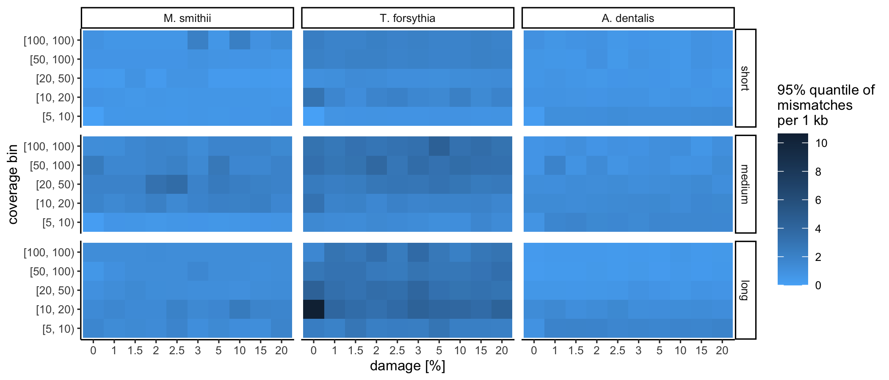

Analysis for Supplementary Information 6
================
Alex Huebner
\`21/07/2020

-   [Results](#results)
    -   [Panel a: Summary of the assembly statistics of Wibowo et
        al.](#panel-a-summary-of-the-assembly-statistics-of-wibowo-et-al.)
    -   [Panel b - Overview of the simulation
        scheme](#panel-b---overview-of-the-simulation-scheme)
    -   [Panel c - Mismatch rate](#panel-c---mismatch-rate)
    -   [Panel d - log2-ratio between C-to-T and other
        substitutions](#panel-d---log2-ratio-between-c-to-t-and-other-substitutions)

The following script reproduces the analysis used to generate Extended
Data Figure 9. It uses the results generated by the simulation workflow
and the general statistics of the contig length, GC content, mean read
length, coverage, and the amount of ancient DNA damage measured as the
frequency of C-to-T substitutions at the 5’ read ends.

# Results

## Panel a: Summary of the assembly statistics of Wibowo et al.

First, we summarised the assembly statistics of 498 medium or high
quality bins assembled using MEGAHIT regarding the parameters contig
length, GC content, coverage, and observed C-to-T substitutions on the
terminal base at 5’ end of the sequencing data. We grouped the observed
values into bins in order to be able to simulate the comparative data
more accurately.

**Extended Data Figure 9a**: **Overview of the number of assembled
contigs per bin with respect to the contig length, the GC content, the
coverage along the contig, and the CtoT substitution frequency on the
terminal base at the 5’ end of the sequencing data.** 94459 contigs from
498 medium or high quality bins were summarised.

## Panel b - Overview of the simulation scheme

Based on the observed values in bins assembled in this study, we
simulated short-read sequencing data with ancient DNA damage using
gargammel (Renauld et al., 2017).

**Extended Data Figure 9b**: **Overview of the parameter space of the
variables GC content, sequencing depth, observed aDNA damage, and read
length that was used for simulating short-read sequencing using
gargammel.**

## Panel c - Mismatch rate

Next, we evaluated the mismatch rate observed when aligning the
consensus sequences of the assembled contigs back to the reference
genomes.

**Extended Data Figure 9c**: **Number of mismatches per 1 kb of
alignable contig sequence with respect to the reference genome as
observed at the 95% quantile for all combinations of reference genome,
read length distribution, simulated aDNA damage, and coverage averaged
across the five replicates.**

## Panel d - log2-ratio between C-to-T and other substitutions

Finally, we compared whether C-to-T substitutions that are indicative of
an effect of ancient DNA damage in the consensus calling of contig
sequences were more frequent than other substitutions.

**Extended Data Figure 9d**: **Log2-ratio of C-to-T substitutions to the
average number of all other substitutions per 1 kb of alignable contig
sequence for all combinations of reference genome, read length
distribution, simulated aDNA damage, and coverage averaged across the
five replicates. Positive values indicate an excess of C-to-T
substitutions.**
